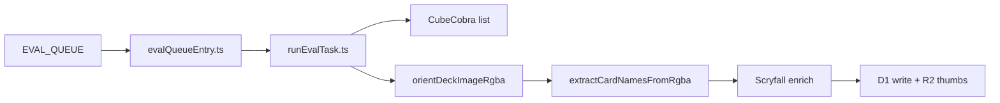

# Eval consumer logic review and prompting improvements

Review of the eval consumer’s vision pipeline (queue → orient → extract → Scryfall → D1) with categorized brainstorming for prompting, OpenAI API, and tool-based improvements—prioritized by impact and fit with the current Responses + JSON-schema architecture.

## Current architecture (what runs today)

| Stage | Entry | OpenAI | Notes |
|-------|--------|--------|--------|
| Queue | [`evalQueueEntry.ts`](src/pipeline/entry/evalQueueEntry.ts) | — | `max_batch_size: 1`, exponential retry (30s × attempts, cap 300s), permanent ack for `PermanentEvalError` / `ModelOutputInvalidError` |
| Orchestration | [`runEvalTask.ts`](src/pipeline/orchestrator/runEvalTask.ts) | — | CubeCobra → orient → extract → Scryfall → D1; orientation uses fixed 2k tokens + `medium` reasoning (ignores `OPENAI_REASONING_EFFORT`) |
| Orientation | [`orientDeckImage.ts`](src/pipeline/orientation/orientDeckImage.ts) | [`ORIENTATION_PROMPT`](src/pipeline/openai/prompts.ts) | Up to 8 iterative 90° steps on **1280px preview**; full frame rotated for extraction |
| Extraction | [`extractCardNames.ts`](src/pipeline/openai/extractCardNames.ts) | [`buildExtractionPrompt`](src/pipeline/openai/prompts.ts) | 2048px JPEG; optional 2–3 passes when cube list exists |
| API layer | [`responsesApi.ts`](src/pipeline/openai/responsesApi.ts) | Responses `POST /v1/responses` | Single **user** message (text + image); `text.format.type = json_schema`; optional `reasoning.effort` |

Hosted eval sends images via **presigned R2 URLs** ([`visionPublish.ts`](src/pipeline/images/visionPublish.ts)); local uses inline base64.

---

## Logic review — strengths

- **Clear separation**: queue reliability vs. vision vs. post-processing (Scryfall/D1).
- **Structured outputs**: Zod + JSON schema reduce parse failures ([`schemas.ts`](src/pipeline/openai/schemas.ts), [`jsonSchemas.ts`](src/pipeline/openai/jsonSchemas.ts)).
- **Orientation/extraction image sizing**: smaller preview for cheap rotation loops; full-res for name reading.
- **Multi-pass recall strategy** (when CubeCobra list exists): pass 1 broad → pass 2 “missed cards” → pass 3 “still missing from cube” if count < 90% of expected 40.
- **Downstream safety net**: Scryfall collection + fuzzy `/cards/named` recovers many OCR-style name errors ([`client.ts`](src/pipeline/scryfall/client.ts)).

## Logic review — risks and gaps

1. **Conflicting extraction goals** in [`prompts.ts`](src/pipeline/openai/prompts.ts): “guess aggressively / never skip” vs. “ONLY return names from the cube list.” That pushes hallucinated in-cube names when the model cannot read a card.
2. **Cube list as a 1000-line bullet dump** (`CW_EVAL_MAX_CUBECOBRA_CARDS`): huge prompt, weak attention; no retrieval or fuzzy canonicalization before Scryfall.
3. **Multi-pass gating**: `useMultiPass` only runs with a cube list ([`extractCardNames.ts`](src/pipeline/openai/extractCardNames.ts) L77–78). Uploads without CubeCobra get a single aggressive pass only.
4. **Pass 3 matching**: `all.has(c)` is exact string equality; model variants (“Jace, the Mind Sculptor” vs. “Jace, The Mind Sculptor”) won’t trigger validation for the canonical cube string.
5. **`expectedDeckSize` defaults to 40** but is never set from `runEvalTask` — pass 3 threshold may be wrong for 60-card sealed or sideboards.
6. **No duplicate / quantity model**: `Set` merge in multi-pass dedupes names; a pile of four `Lightning Bolt` becomes one string → `total_cards` and deck stats skew.
7. **Orientation `confidence` is unused**: low-confidence rotations still apply; no second opinion or skip.
8. **No post-extract constraint**: names not in cube list are not filtered in code before Scryfall (only prompted).
9. **Cost/latency**: orientation loop × multi-pass × 20k `max_output_tokens` + `reasoning: medium` on a reasoning model — tight against **30s CPU** ([`wrangler-eval-consumer.jsonc`](wrangler-eval-consumer.jsonc)).
10. **No prompt/API tests**: only [`responsesApi.test.ts`](src/pipeline/openai/responsesApi.test.ts) mocks HTTP; prompts and multi-pass behavior are unverified in CI.

---

## Improvements by category

### A. Prompt language and task design

| Idea | Rationale |
|------|-----------|
| **Split system vs. user roles** | Move stable MTG rules + output contract to `role: "developer"` or `system`; user message = image + task-specific context (cube id, pass number). Reduces drift and token repetition across passes. |
| **Replace “100% detection / guess everything” with tiered rules** | e.g. (1) include only if name is **legibly readable** on the title bar; (2) if illegible, emit `unreadable_slots: N` or skip — aligns with Scryfall truth and reduces phantom cards. |
| **Explicit scan protocol** | “Divide image into a 3×3 grid; list cards per cell left-to-right” — improves coverage without encouraging fabrication. |
| **Clarify cube-list usage** | “Prefer exact spellings from the list when the visible name matches; if uncertain between two list cards, pick neither; never invent a list card you cannot see.” |
| **Handle MTG edge cases in prose** | Split cards / DFC (name on front), adventure cards, tokens without names, sleeves/glare, foils, foreign text — reduces systematic errors. |
| **Per-pass prompt specialization** | Pass 1: count + names; Pass 2: **only** additions with “diff from prior list”; Pass 3: multiple-choice from **short** candidate set (see B), not 120 comma-separated names. |
| **Orientation prompt: single-shot 0/90/180/270** | Ask model to pick **final** rotation in one call when using a capable vision model; reserve iterative loop for low confidence only. |
| **Few-shot (text-only) examples** | 1–2 short examples of “visible title → correct JSON” and “blurry corner → omit” in developer message (no extra images unless you add a eval fixture). |
| **Ask for `visible_card_count` in schema** | Compare to `card_names.length` in code; if names << count, auto-trigger pass 2 without relying on cube list. |

### B. Schema and structured output (prompt-adjacent)

| Idea | Rationale |
|------|-----------|
| **Richer extraction schema** | `{ cards: [{ name, confidence: high\|medium\|low, region?: quadrant }] }` — filter `low` before Scryfall; optional region helps debugging. |
| **`strict: true` where possible** | [`responsesApi.ts`](src/pipeline/openai/responsesApi.ts) defaults `strictJsonSchema: false`; tightening schema improves adherence (may require `required` on all properties). |
| **Quantities** | `card_names` as `{ name, count }[]` or repeat names — fixes duplicate pile undercount. |
| **Orientation: require `reasoning` when confidence ≠ high** | Enables conditional re-call or human flag. |

### C. New tools (model-invoked or pipeline “tools”)

| Tool | Role |
|------|------|
| **`resolve_card_name`** | Fuzzy match candidate string → CubeCobra canonical name (Levenshtein / token set) before Scryfall. Cheap, deterministic, runs in Worker. |
| **`scryfall_verify_name`** | OpenAI tool: `GET /cards/named?fuzzy=` — model only commits names that resolve (rate-limit aware; batch in code after model proposes list). |
| **`search_cube_candidates`** | Given partial OCR string, return top-k names from cube list (inverted index) — replaces dumping 1000 bullets into prompt. |
| **`crop_region` / tile** | Pre-split dense photos; model sees 4–6 tiles sequentially — better than one 2048px frame for 40+ small cards. |
| **Classical CV pre-pass** (non-LLM) | Optional card-count / blob detection to set `expectedDeckSize` and trigger extra passes — no API cost. |

*Note:* Cloudflare Worker + Scryfall etiquette favors **post-model batch verify** in TypeScript over many parallel tool calls inside one Responses turn.

### D. Advanced OpenAI API usage

| Idea | Rationale |
|------|-----------|
| **Developer + user multi-turn in one Response** | Chain: “Here is pass-1 result JSON” as prior input item; improves pass 2/3 without stuffing everything into one user string. |
| **`previous_response_id` / conversation state** | If supported for your model tier, reuse context across passes on same image without resending full cube list. |
| **Reasoning effort per phase** | `low` for orientation, `medium`/`high` only for extraction pass 1; env-driven orientation effort (today hardcoded in `runEvalTask`). |
| **Model routing** | Cheaper/faster model for orientation; stronger model for extraction only — cuts cost and CPU time. |
| **Image detail / input fidelity** | If Responses API exposes equivalent of `detail: high` / input resolution controls, use **high** for extraction, **low/auto** for orientation preview. |
| **Prompt caching** | Static developer prompt + cube list prefix caching (where available) — large savings when list is 500–1000 names. |
| **Self-consistency / voting** | 2× pass 1 at `temperature` > 0 (if allowed on reasoning models), merge names present in both — reduces random misses (2× cost). |
| **Batch API** | Offline reprocessing / QA only — not for queue consumer latency. |
| **Store + eval harness** | Log `response.id` + image key for regression on prompt changes ([`CW_EVAL_LOG_LEVEL=high`](README.md)). |

### E. Pipeline orchestration (complements prompting)

| Idea | Rationale |
|------|-----------|
| **Always run pass 2** when `card_names.length` < threshold or `visible_card_count` mismatch — even without CubeCobra. |
| **Post-process: fuzzy map to cube list** | Deterministic filter before Scryfall when list exists — enforces prompt rule in code. |
| **Dedupe vs. quantity policy** | Product decision: store unique names + count field vs. one row per physical card. |
| **Wire `expectedDeckSize`** from cube metadata or env (40/60). |
| **Use `confidence_level` / per-card confidence** | Retry extraction once with `reasoning: high` when global confidence is `low`. |
| **Golden-set regression** | Extend [`visualQa.manual.test.ts`](src/pipeline/images/visualQa.manual.test.ts) with labeled deck photos + expected name sets in CI (mock OpenAI). |

---

## Suggested priority (if implementing later)

1. **Quick wins (prompt + code, no new API features):** tiered inclusion rules, cube-list wording fix, post-extract fuzzy match to cube, pass-2 without cube list, wire `expectedDeckSize`, quantity in schema.
2. **Medium:** developer/system split, candidate retrieval instead of full list, per-card confidence filtering, orientation single-shot + confidence gate.
3. **Larger:** tile/crop pipeline, Scryfall verify tool loop, model split, prompt caching, CI golden deck tests.

---

## Implementation checklist

- [ ] Rewrite extraction/orientation prompts: tiered inclusion, cube-list disambiguation, scan protocol
- [ ] Add deterministic fuzzy match + optional filter to CubeCobra list before Scryfall
- [ ] Extend JSON schema: per-card confidence, counts, visible_card_count; filter lows in pipeline
- [ ] Split developer/system messages; explore previous_response_id / prompt caching for cube list
- [ ] Pass 2 without cube list; wire expectedDeckSize; optional orientation confidence gate

---

## Key files to touch for implementation

- [`src/pipeline/openai/prompts.ts`](src/pipeline/openai/prompts.ts) — primary prompt copy
- [`src/pipeline/openai/extractCardNames.ts`](src/pipeline/openai/extractCardNames.ts) — multi-pass orchestration
- [`src/pipeline/openai/responsesApi.ts`](src/pipeline/openai/responsesApi.ts) — roles, caching, conversation items
- [`src/pipeline/openai/jsonSchemas.ts`](src/pipeline/openai/jsonSchemas.ts) + [`schemas.ts`](src/pipeline/openai/schemas.ts)
- [`src/pipeline/orchestrator/runEvalTask.ts`](src/pipeline/orchestrator/runEvalTask.ts) — env wiring, post-process hook
- New small module e.g. `src/pipeline/cards/normalizeToCubeList.ts` for fuzzy matching
