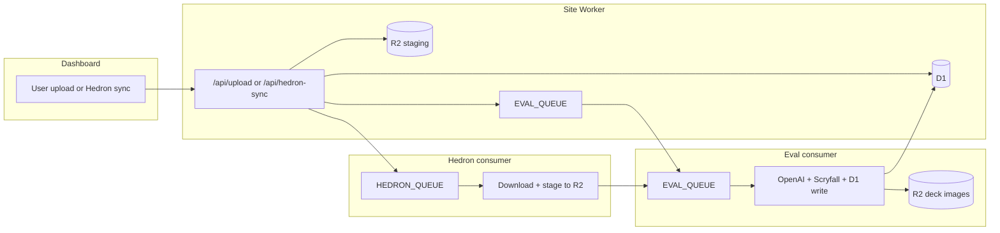

# CubeWizard

Magic: The Gathering cube analytics: deck photos are processed with OpenAI Vision, enriched via Scryfall, stored in Cloudflare D1, and served from a Worker-hosted dashboard (`docs/`).

---

## Architecture

### Components

| Piece | Config | Role |
|--------|--------|------|
| **Site Worker** | `src/worker.js`, `wrangler.jsonc` | Serves the dashboard (`docs/`), REST API, uploads deck images to R2, enqueues eval jobs |
| **Eval consumer** | `src/pipeline/entry/evalQueueEntry.ts`, `wrangler-eval-consumer.jsonc` | Queue consumer: orientation → card extraction (OpenAI) → Scryfall → D1 → oriented images on R2 |
| **Hedron consumer** | `src/hedron-consumer.js`, `wrangler-hedron-consumer.jsonc` | Consumes Hedron sync jobs, stages images in R2, enqueues eval tasks |
| **Redirect Worker** | `wrangler-redirect.jsonc` | Production only: `cubewizard.org` → `cube-wizard.com` |
| **D1** | `schema.sql`, `migrations/` | Cubes, decks, cards, stats, `processing_jobs`, Hedron sync state |
| **R2** | `decklist-uploads`, `cubewizard-deck-images` | Raw uploads + metadata; oriented deck images and thumbnails |

Eval task JSON is defined in `fixtures/pipeline/task-request.schema.json` and validated in `src/pipeline/contracts/taskRequest.zod.ts`.

### Request flow



**Manual upload:** `POST /api/upload` writes `decklist-uploads`, upserts `processing_jobs` (`queued`), and sends a task to `EVAL_QUEUE`.

**Hedron sync:** `POST /api/hedron-sync/:cubeId` enqueues the Hedron consumer, which fetches deck images from Hedron, stages them under the same R2 layout, then enqueues the eval consumer with `upload_id` prefixed `hedron:`.

**Eval pipeline** (`runEvalTask`): load staging image from R2 → orient (OpenAI) → extract card names (OpenAI, optional multi-pass) → optional CubeCobra list → Scryfall enrichment → D1 deck/cards/stats → upload oriented WebP + thumb to `cubewizard-deck-images` → mark `processing_jobs` done or failed.

### Local vs staging vs production

| | **Local** (`wrangler dev`) | **Staging** (`--env stg`) | **Production** (`--env prod`) |
|--|---------------------------|---------------------------|-------------------------------|
| **Trigger** | `npm run dev:all` | Push to `staging` (GitHub Actions) | Push to `main` (GitHub Actions) |
| **Site Worker** | `cubewizard-cloudflare-worker` @ :8787 | `cubewizard-stg` | `cubewizard-prod` |
| **Eval consumer** | bundled in dev @ :8788 | `cubewizard-eval-consumer-stg` | `cubewizard-eval-consumer-prod` |
| **Hedron consumer** | bundled in dev @ :8789 | `cubewizard-hedron-consumer-stg` | `cubewizard-hedron-consumer-prod` |
| **`CWW_ENV`** | `local` | `staging` | `production` |
| **D1** | Miniflare under `.wrangler/local-shared` (`npm run d1:bootstrap:local`) | Remote `cubewizard-db-stg` | Remote `cubewizard-db` |
| **Queues** | `*-local` / `*-local-dlq` (Miniflare only) | `cubewizard-eval-stg`, `cubewizard-hedron-stg`, … | `cubewizard-eval-prod`, `cubewizard-hedron-prod`, … |
| **R2** | Local Miniflare buckets (same binding names) | Hosted `decklist-uploads`, `cubewizard-deck-images` | Same buckets as staging |
| **OpenAI vision images** | Inline JPEG base64 (`CWW_ENV=local`) | Presigned R2 GET URLs | Same as staging |
| **Eval secrets** | `.dev.vars`: `OPENAI_API_KEY` only | + `R2_ACCESS_KEY_ID`, `R2_SECRET_ACCESS_KEY` | Same as staging |
| **Turnstile** | Optional when `CWW_ENV=local` | `TURNSTILE_SECRET` on site Worker | Same |
| **Hedron auto-update** | None | None (`scheduled` skipped on stg) | Daily cron on site Worker (`0 7 * * *`) |
| **Redirect Worker** | N/A | Not deployed by stg workflow | `wrangler-redirect.jsonc` |

Hosted queues and D1 must exist in the Cloudflare account before deploy; local `*-local` queue names are created by Miniflare and do not need dashboard setup.

---

## Local development

### Prerequisites

- **Node.js 22** (matches [CI](.github/workflows/ci.yml))
- npm
- **OpenAI API key** for end-to-end eval testing
- Optional: [Wrangler login](https://developers.cloudflare.com/workers/wrangler/commands/#login) only if you deploy or use remote D1/R2 from your machine

### First-time setup

```bash
git clone <repo-url>
cd CubeWizard
npm ci
cp .dev.vars.example .dev.vars    # set OPENAI_API_KEY (required for eval)
npm run d1:bootstrap:local        # once per fresh .wrangler/local-shared
npm run dev:all                   # site + eval + hedron in one Wrangler session
```

Open the dashboard at **http://127.0.0.1:8787**.

Use **`npm run dev:all`** (or `npm run dev:terminals` on Windows to open it in a new window). Running `dev`, `dev:eval-consumer`, and `dev:hedron-consumer` in **separate** terminals does **not** share queues locally—the eval queue will not drain.

### Configuration files

| File | Purpose |
|------|---------|
| **`.dev.vars`** | Secrets and vars for **all** `wrangler dev` processes (site, eval, hedron). Copy from [`.dev.vars.example`](.dev.vars.example). |

#### `.dev.vars` (Workers)

| Variable | Required locally | Notes |
|----------|------------------|--------|
| `OPENAI_API_KEY` | Yes (for eval) | Eval consumer secret |
| `CW_EVAL_LOG_LEVEL` | No | `off` \| `low` \| `medium` \| `high` — see [OpenAI log levels](#openai-log-levels-cw_eval_log_level) |
| `CW_EVAL_MAX_IMAGE_SIDE` | No | Default `2048`; caps decode memory (128 MiB isolate limit) |
| `CW_EVAL_ORIENT_MAX_SIDE` | No | Default `1280`; orientation preview only |
| `TURNSTILE_SECRET` | No | Site upload bot check; skipped when `CWW_ENV=local` |

Hosted eval also needs `R2_ACCESS_KEY_ID` and `R2_SECRET_ACCESS_KEY` (same R2 API token) via `wrangler secret put` — see [Deploy](#deploy-cloudflare).

### npm scripts (dev)

| Script | Description |
|--------|-------------|
| `npm run dev:all` | Site + eval + hedron consumers, shared local queue/D1/R2. Use this for E2E testing |
| `npm run dev` | Site Worker only |
| `npm run dev:eval-consumer` | Eval only |
| `npm run dev:hedron-consumer` | Hedron only |
| `npm run d1:bootstrap:local` | Apply `schema.sql` to local D1 |
| `npm run test:pipeline` | Vitest pipeline unit tests |
| `npm run wrangler:check` | Dry-run deploy all Wrangler configs |

### Tests and CI parity

```bash
npm ci
npm run test:pipeline
```

Optional visual QA on a folder of images:

```bash
# PowerShell
$env:PIPELINE_QA_INPUT="C:\path\to\images"
npm run test:pipeline:qa
```

### Reset local data

Stop Wrangler, then:

```powershell
Remove-Item -Recurse -Force .wrangler\local-shared -ErrorAction SilentlyContinue
npm run d1:bootstrap:local
```


#### OpenAI log levels (`CW_EVAL_LOG_LEVEL`)

| Level | Behavior |
|-------|----------|
| `off` | No extra OpenAI logs |
| `low` | Model structured JSON text only |
| `medium` | Human-readable phase lines |
| `high` | Request metadata, raw JSON (truncated), parsed objects |

### Branches and releases

| Branch | Role |
|--------|------|
| **`staging`** | Integration branch. Contributor PRs merge here. Pushes deploy the **staging** stack ([`deploy-cloudflare-stg.yml`](.github/workflows/deploy-cloudflare-stg.yml)). |
| **`main`** | Production. Updated when maintainers **promote** `staging` → `main`. Pushes deploy **production** ([`deploy-cloudflare-prod.yml`](.github/workflows/deploy-cloudflare-prod.yml)). |

Do not open PRs directly against `main` unless a maintainer requests a hotfix exception.

### Pull request workflow

1. Branch from **`staging`**: `git fetch origin`, `git checkout staging`, `git pull`.
2. Implement focused changes; match style in `src/worker.js` and `src/pipeline/`.
3. Before review, run the same checks as CI:

   ```bash
   npm ci
   npm run test:pipeline
   ```

4. Open a PR **into `staging`**.
5. Never commit secrets (`.dev.vars`, API keys). Use `.dev.vars.example` as the template.

After merge to `staging`, the next deploy ships to the staging environment. Production is updated separately when maintainers promote to `main`.

### Maintainer notes

- **Promote to production:** merge `staging` into `main` (PR or direct merge) after staging validation.
- **Repo secrets (GitHub):** `CLOUDFLARE_API_TOKEN` (Workers, Queues, D1, R2). Optional `CLOUDFLARE_ACCOUNT_ID` if Wrangler cannot infer it from the token.

### Third-party assets

WebP WASM under `vendor/jsquash-webp/` comes from [@jsquash/webp](https://www.npmjs.com/package/@jsquash/webp) (Apache-2.0). See [WebP WASM vendor](#webp-wasm-vendor).

---


### GitHub Actions

| Workflow | Trigger | Purpose |
|----------|---------|---------|
| [`ci.yml`](.github/workflows/ci.yml) | PR / push to `staging` or `main` | `npm ci`, `test:pipeline`, `wrangler:check` |
| [`deploy-cloudflare-stg.yml`](.github/workflows/deploy-cloudflare-stg.yml) | Push to `staging` | Deploy site, eval, hedron (`--env stg`) |
| [`deploy-cloudflare-prod.yml`](.github/workflows/deploy-cloudflare-prod.yml) | Push to `main` | Deploy site, eval, hedron, redirect (`--env prod`) |

Reproduce CI locally: `npm ci && npm run test:pipeline && npm run wrangler:check`

### Queues (hosted; once per environment)

| Env | Eval | Eval DLQ | Hedron | Hedron DLQ |
|-----|------|----------|--------|------------|
| Staging | `cubewizard-eval-stg` | `cubewizard-eval-stg-dlq` | `cubewizard-hedron-stg` | `cubewizard-hedron-stg-dlq` |
| Production | `cubewizard-eval-prod` | `cubewizard-eval-prod-dlq` | `cubewizard-hedron-prod` | `cubewizard-hedron-prod-dlq` |

---

## Reference

### Worker API (summary)

| Endpoint | Method | Description |
|----------|--------|-------------|
| `/api/cubes` | GET | List cubes |
| `/api/dashboard/:cubeId` | GET | Dashboard aggregates |
| `/api/decks/:cubeId` | GET | Deck list with image URLs |
| `/api/deck/:deckId` | GET | Single deck + cards |
| `/api/deck/:deckId/cards` | PUT | Replace deck card list (Scryfall resolve) |
| `/api/upload` | POST | Upload deck image → R2 → eval queue |
| `/api/processing-decks/:cubeId` | GET | In-flight `processing_jobs` |
| `/api/hedron-sync/:cubeId` | POST | Trigger Hedron import |
| `/api/validate-cube` | POST | CubeCobra cube check |
| `/api/add-cube` | POST | Register cube in D1 |

Deck photos and thumbnails are served via the site Worker proxy (`/api/deck/:deckId/photo` and `/thumb`).

### Database (D1)

Tables include `cubes`, `decks`, `deck_cards`, `deck_stats`, `cube_mapping`, `processing_jobs`, and Hedron sync tables (see `schema.sql`).

### Project layout

```
CubeWizard/
├── src/
│   ├── worker.js                 # Site Worker
│   ├── hedron-consumer.js        # Hedron queue consumer
│   ├── processingJobsD1.js       # Shared processing_jobs upsert
│   └── pipeline/                 # Eval pipeline (TypeScript, Vitest)
├── docs/                         # Static site (HTML/CSS/JS)
├── fixtures/pipeline/            # Task JSON schema + examples
├── vendor/jsquash-webp/          # Vendored WebP WASM
├── migrations/                   # D1 incremental SQL
├── schema.sql
├── wrangler.jsonc
├── wrangler-eval-consumer.jsonc
├── wrangler-hedron-consumer.jsonc
└── wrangler-redirect.jsonc
```


### WebP WASM vendor

Binaries under `vendor/jsquash-webp/` match `@jsquash/webp` in `package.json`. After bumping that package:

```powershell
$v = "1.5.0"
Invoke-WebRequest "https://unpkg.com/@jsquash/webp@$v/codec/enc/webp_enc.wasm" -OutFile vendor/jsquash-webp/webp_enc.wasm
Invoke-WebRequest "https://unpkg.com/@jsquash/webp@$v/codec/enc/webp_enc_simd.wasm" -OutFile vendor/jsquash-webp/webp_enc_simd.wasm
Invoke-WebRequest "https://unpkg.com/@jsquash/webp@$v/codec/dec/webp_dec.wasm" -OutFile vendor/jsquash-webp/webp_dec.wasm
```

---

## License

CubeWizard is licensed under [GPL-3.0-or-later](LICENSE).
