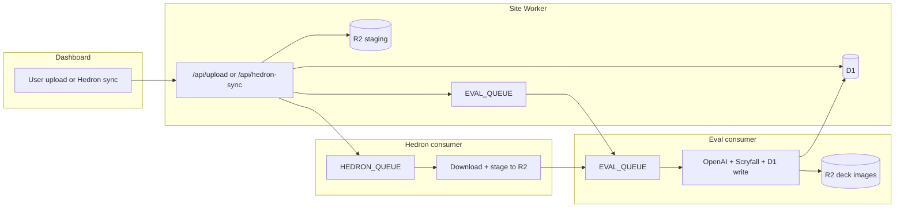

# CubeWizard

Magic: The Gathering cube analytics: deck photos are processed with OpenAI Vision, enriched via Scryfall, stored in Cloudflare D1, and served from a Worker-hosted dashboard (`docs/`).

---

## Architecture

### Components

| Piece | Config | Role |
|--------|--------|------|
| **Site Worker** | `src/worker.js`, `wrangler.jsonc` | Serves the dashboard (`docs/`), REST API, uploads deck images to R2, enqueues eval jobs |
| **Eval consumer** | `src/pipeline/entry/evalQueueEntry.ts`, `wrangler-eval-consumer.jsonc` | Queue consumer: orientation → card extraction (OpenAI) → Scryfall → D1 → oriented images on R2 |
| **Hedron consumer** | `src/hedron-consumer.js`, `wrangler-hedron-consumer.jsonc` | Consumes Hedron sync jobs, stages images in R2, enqueues eval tasks |
| **Redirect Worker** | `wrangler-redirect.jsonc` | Production only: `cubewizard.org` → `cube-wizard.com` |
| **D1** | `schema.sql`, `migrations/` | Cubes, decks, cards, stats, `processing_jobs`, Hedron sync state |
| **R2** | `decklist-uploads`, `cubewizard-deck-images` | Raw uploads + metadata; oriented deck images and thumbnails |

Eval task JSON is defined in `fixtures/pipeline/task-request.schema.json` and validated in `src/pipeline/contracts/taskRequest.zod.ts`.

### Request flow


```mermaid
flowchart LR
  subgraph ui [Dashboard]
    U[User upload or Hedron sync]
  end
  subgraph site [Site Worker]
    API["/api/upload or /api/hedron-sync"]
    R2s[(R2 staging)]
    D1s[(D1)]
    Qe[EVAL_QUEUE]
  end
  subgraph hedron [Hedron consumer]
    Qh[HEDRON_QUEUE]
    Stage[Download + stage to R2]
  end
  subgraph eval [Eval consumer]
    Qev[EVAL_QUEUE]
    Pipe[OpenAI + Scryfall + D1 write]
    R2o[(R2 deck images)]
  end
  U --> API
  API --> R2s
  API --> D1s
  API --> Qe
  API --> Qh
  Qh --> Stage
  Stage --> Qev
  Qe --> Qev
  Qev --> Pipe
  Pipe --> D1s
  Pipe --> R2o
```

**Manual upload:** `POST /api/upload` writes `decklist-uploads`, upserts `processing_jobs` (`queued`), and sends a task to `EVAL_QUEUE`.

**Hedron sync:** `POST /api/hedron-sync/:cubeId` enqueues the Hedron consumer, which fetches deck images from Hedron, stages them under the same R2 layout, then enqueues the eval consumer with `upload_id` prefixed `hedron:`.

**Eval pipeline** (two queue stages — separate queue invocations; isolates may be reused by the platform but deck buffers are not retained across messages):

1. **Orient** (`runOrientTask` on `EVAL_QUEUE`): load staging image → orient (OpenAI) → upload oriented JPEG to `cubewizard-deck-images` → enqueue extract message.
2. **Extract** (`runExtractTask` on `EVAL_EXTRACT_QUEUE`): load oriented JPEG → extract card names (OpenAI) → upload WebP thumb → release RGBA → Scryfall → D1 → mark `processing_jobs` done.

Hosted accounts need extract queues created once, e.g. `npx wrangler queues create cubewizard-eval-extract-stg` (and `-dlq`, plus prod names) before deploy.

**Eval queue concurrency:** `max_batch_size: 1` (one deck per invocation) and `max_concurrency` > 1 in `wrangler-eval-consumer.jsonc` so Cloudflare runs multiple consumer isolates when the queue has backlog (stg/prod: 4). Keep `CW_EVAL_MAX_CONSUMERS` equal to `max_concurrency` so Scryfall HTTP stays near ~10 req/s account-wide. **Local `wrangler dev` does not run multiple queue consumers in parallel** ([Cloudflare Queues local dev](https://developers.cloudflare.com/queues/configuration/local-development/)) — you will only see one eval at a time locally even with `max_concurrency: 2`; deploy to staging/production for real parallelism.

### Local vs staging vs production

| | **Local** (`wrangler dev`) | **Staging** (`--env stg`) | **Production** (`--env prod`) |
|--|---------------------------|---------------------------|-------------------------------|
| **Trigger** | `npm run dev:all` | Push to `staging` (GitHub Actions) | Push to `main` (GitHub Actions) |
| **Site Worker** | `cubewizard-cloudflare-worker` @ :8787 | `cubewizard-stg` | `cubewizard-prod` |
| **Eval consumer** | bundled in dev @ :8788 | `cubewizard-eval-consumer-stg` | `cubewizard-eval-consumer-prod` |
| **Hedron consumer** | bundled in dev @ :8789 | `cubewizard-hedron-consumer-stg` | `cubewizard-hedron-consumer-prod` |
| **`CWW_ENV`** | `local` | `staging` | `production` |
| **D1** | Miniflare under `.wrangler/local-shared` (`npm run d1:bootstrap:local`) | Remote `cubewizard-db-stg` | Remote `cubewizard-db` |
| **Queues** | `*-local` / `*-local-dlq` (Miniflare only) | `cubewizard-eval-stg`, `cubewizard-hedron-stg`, … | `cubewizard-eval-prod`, `cubewizard-hedron-prod`, … |
| **R2** | Local Miniflare buckets (same binding names) | Hosted `decklist-uploads`, `cubewizard-deck-images` | Same buckets as staging |
| **OpenAI vision images** | Inline JPEG base64 (`CWW_ENV=local`) | Presigned R2 GET URLs | Same as staging |
| **Eval secrets** | `.dev.vars`: `OPENAI_API_KEY` only | + `R2_ACCESS_KEY_ID`, `R2_SECRET_ACCESS_KEY` | Same as staging |
| **Turnstile** | Optional when `CWW_ENV=local` | `TURNSTILE_SECRET` on site Worker | Same |
| **Hedron auto-update** | None | None (`scheduled` skipped on stg) | Daily cron on site Worker (`0 7 * * *`) |
| **Redirect Worker** | N/A | Not deployed by stg workflow | `wrangler-redirect.jsonc` |

Hosted queues and D1 must exist in the Cloudflare account before deploy; local `*-local` queue names are created by Miniflare and do not need dashboard setup.

---

## Local development

### Prerequisites

- **Node.js 22** (matches [CI](.github/workflows/ci.yml))
- npm
- **OpenAI API key** for end-to-end eval testing
- Optional: [Wrangler login](https://developers.cloudflare.com/workers/wrangler/commands/#login) only if you deploy or use remote D1/R2 from your machine

### First-time setup

```bash
git clone <repo-url>
cd CubeWizard
npm ci
cp .dev.vars.example .dev.vars    # set EVAL_VISION_API_KEY + EVAL_VISION_MODEL (required for eval)
# Create AI Gateway `cubewizard` in Cloudflare Dashboard (retry, rate limit, caching) — see
# https://developers.cloudflare.com/ai-gateway/get-started/ — before running eval (local uses gateway by default).
npm run d1:bootstrap:local        # once per fresh .wrangler/local-shared
npm run dev:all                   # site + eval + hedron in one Wrangler session
```

Open the dashboard at **http://127.0.0.1:8787**.

Use **`npm run dev:all`** (or `npm run dev:terminals` on Windows to open it in a new window). Running `dev`, `dev:eval-consumer`, and `dev:hedron-consumer` in **separate** terminals does **not** share queues locally—the eval queue will not drain.

### Configuration files

| File | Purpose |
|------|---------|
| **`.dev.vars`** | Secrets and vars for **all** `wrangler dev` processes (site, eval, hedron). Copy from [`.dev.vars.example`](.dev.vars.example). |

#### `.dev.vars` (Workers)

| Variable | Required locally | Notes |
|----------|------------------|--------|
| `EVAL_VISION_MODEL` | Yes (for eval) | Chat Completions `model` (must match gateway provider route) |
| `EVAL_VISION_API_KEY` | Yes (for eval) | Provider API key; Bearer forwarded by AI Gateway |
| `EVAL_VISION_BASE_URL` | No | Full gateway/API base (no `/chat/completions`). Default: `…/cubewizard/openai` in wrangler |
| `EVAL_GATEWAY_PROVIDER` | No | Swap provider segment on default gateway host, e.g. `anthropic`, `google-ai-studio` |
| `OPENAI_API_KEY` / `OPENAI_VISION_MODEL` | No | Legacy aliases for `EVAL_VISION_*` |
| `OPENAI_BASE_URL` | No | Legacy alias for `EVAL_VISION_BASE_URL` |
| `OPENAI_GATEWAY_TOKEN` | No | Only if Authenticated Gateway is enabled on `cubewizard` |
| `OPENAI_REQUEST_TIMEOUT_MS` | No | AI Gateway `cf-aig-request-timeout` (default `300000`); ignored for direct `OPENAI_BASE_URL` |
| `CW_EVAL_LOG_LEVEL` | No | `off` \| `low` \| `medium` \| `high` — see [OpenAI log levels](#openai-log-levels-cw_eval_log_level) |
| `CW_EVAL_MAX_IMAGE_SIDE` | No | Default in wrangler eval config: `3072` px max side; unset/`0`/`full` = source resolution |
| `CW_EVAL_MAX_CONSUMERS` | No | Must match queue `max_concurrency` in `wrangler-eval-consumer.jsonc` (Scryfall throttle) |
| `CW_EVAL_MEMORY_LOG` | No | `1` / `true` / `yes` → attach `heap_used_mb` / `rss_mb` to each `eval_consumer` log line (see [Memory debugging](#memory-debugging-eval-consumer)) |
| `CW_STAGING_MAX_IMAGE_SIDE` | No | Site + Hedron staging normalize via Cloudflare Images (default `3072` in wrangler) |
| `CW_STAGING_JPEG_QUALITY` | No | JPEG quality for normalized staging uploads (default `90`) |
| `TURNSTILE_SECRET` | No | Site upload bot check; skipped when `CWW_ENV=local` |

Hosted eval also needs `R2_ACCESS_KEY_ID` and `R2_SECRET_ACCESS_KEY` (same R2 API token) via `wrangler secret put` — see [Deploy](#deploy-cloudflare).

### npm scripts (dev)

| Script | Description |
|--------|-------------|
| `npm run dev:all` | Site + eval + hedron consumers, shared local queue/D1/R2. Use this for E2E testing |
| `npm run dev` | Site Worker only |
| `npm run dev:eval-consumer` | Eval only |
| `npm run dev:hedron-consumer` | Hedron only |
| `npm run d1:bootstrap:local` | Apply `schema.sql` to local D1 |
| `npm run test:pipeline` | Vitest pipeline unit tests |
| `npm run golden:eval` | Golden-set run (eval consumer + live OpenAI); writes `scores/latest.json` and compares to baseline |
| `npm run golden:baseline` | Promote `scores/latest.json` → `scores/baseline.json` after confirmation (`--yes` to skip prompt) |
| `npm run wrangler:check` | Dry-run deploy all Wrangler configs |

### Tests and CI parity

```bash
npm ci
npm run test:pipeline
```

Optional visual QA on a folder of images:

```bash
# PowerShell
$env:PIPELINE_QA_INPUT="C:\path\to\images"
npm run test:pipeline:qa
```

**Golden-set eval** (deck photos + expected card names): see [`fixtures/eval-golden/README.md`](fixtures/eval-golden/README.md). After adding cases, run `npm run golden:eval` (live OpenAI + comparison report), then `npm run golden:baseline` when you want to commit a new reference.

### Reset local data

Stop Wrangler, then:

```powershell
Remove-Item -Recurse -Force .wrangler\local-shared -ErrorAction SilentlyContinue
npm run d1:bootstrap:local
```


#### Memory debugging (eval consumer)

Workers have a **128 MiB per-isolate** limit. Cloudflare does not expose a production heap profiler; use a mix of platform tools and opt-in pipeline logs.

**Staging normalize (Phase 1):** Upload and Hedron staging use the **Cloudflare Images** Worker binding (`env.IMAGES`) to downscale photos to `CW_STAGING_MAX_IMAGE_SIDE` (default 3072 px) **before** R2 — transform runs outside the isolate, avoiding full-resolution RGBA decode (~93 MB on 12 MP JPEGs). Each normalize is one Images transformation (see [Images pricing](https://developers.cloudflare.com/images/pricing/)); binding calls may require **Images Paid** on your account. Local `wrangler dev` uses a low-fidelity Images sim; set `"remote": true` on the `images` binding or use `wrangler dev --remote` for production parity.

| Approach | When to use |
|----------|-------------|
| **`CW_EVAL_MEMORY_LOG=1`** in `.dev.vars` or eval worker vars | Each **`eval_consumer`** JSON line includes `est_*` buffer MB (RGBA/JPEG sizes) plus `heap_used_mb` / `rss_mb` when `process.memoryUsage()` is real (`enable_nodejs_process_v2` on the eval worker). All-zero heap → `heap_probe_unavailable` and rely on `est_*`. |
| **Cloudflare Images staging** (`IMAGES` binding on site + hedron workers) | Caps eval input size; avoids OOM from decode-before-resize on camera photos. |
| **`wrangler tail cubewizard-eval-consumer-stg`** (or `-prod`) | Live hosted logs; OOM failures often show `Exceeded Memory`, Error **1102**, or `likely_memory_limit: true` on `eval_consumer` with `kind: queue_job_failed`. |
| **Dashboard → Workers → eval consumer → Observability → Logs** | Query `eval_consumer` or `$metadata.trigger` / invocation errors; Metrics → Errors → **Exceeded Memory**. |
| **Local DevTools memory snapshots** | `npm run dev:all`, press **`D`**, Memory tab, reproduce with production-like image size ([CF docs](https://developers.cloudflare.com/workers/observability/dev-tools/memory-usage/)). |
| **Lower `CW_EVAL_MAX_IMAGE_SIDE`** (default `3072` in wrangler) | Primary lever when `est_rgba_mb` or `est_rgba_peak_mb` approaches ~100+ MB. |

`CW_EVAL_LOG_LEVEL=medium|high` still adds human-readable OpenAI/orientation detail on top of the structured `eval_consumer` lines. `eval_usage_report` at the end of extract still summarizes token totals per upload.

`est_rgba_mb` is the oriented frame at max side (W×H×4); `est_rgba_peak_mb` adds a rotation scratch during orient scoring. These are estimates, not isolate heap — compare them to the 128 MiB limit when `heap_used_mb` is unavailable locally.

#### OpenAI log levels (`CW_EVAL_LOG_LEVEL`)

| Level | Behavior |
|-------|----------|
| `off` | No extra OpenAI logs |
| `low` | Model structured JSON text only |
| `medium` | Human-readable phase lines |
| `high` | Request metadata, raw JSON (truncated), parsed objects |

### Branches and releases

| Branch | Role |
|--------|------|
| **`staging`** | Integration branch. Contributor PRs merge here. Pushes deploy the **staging** stack ([`deploy-cloudflare-stg.yml`](.github/workflows/deploy-cloudflare-stg.yml)). |
| **`main`** | Production. Updated when maintainers **promote** `staging` → `main`. Pushes deploy **production** ([`deploy-cloudflare-prod.yml`](.github/workflows/deploy-cloudflare-prod.yml)). |

Do not open PRs directly against `main` unless a maintainer requests a hotfix exception.

### Pull request workflow

1. Branch from **`staging`**: `git fetch origin`, `git checkout staging`, `git pull`.
2. Implement focused changes; match style in `src/worker.js` and `src/pipeline/`.
3. Before review, run the same checks as CI:

   ```bash
   npm ci
   npm run test:pipeline
   ```

4. Open a PR **into `staging`**.
5. Never commit secrets (`.dev.vars`, API keys). Use `.dev.vars.example` as the template.

After merge to `staging`, the next deploy ships to the staging environment. Production is updated separately when maintainers promote to `main`.

### Maintainer notes

- **Promote to production:** open a PR from `staging` into `main` after staging validation (no direct pushes to `main`).
- **Branch protection:** `staging` and `main` use [repository rulesets](https://github.com/53rpent/cubewizard/rules). Merges require one approval from a [CODEOWNERS](.github/CODEOWNERS) maintainer and passing CI checks **`test`** and **`wrangler-check`**. After editing [`.github/rulesets/`](.github/rulesets/), run [`scripts/apply-github-rulesets.ps1`](scripts/apply-github-rulesets.ps1) or [`scripts/apply-github-rulesets.sh`](scripts/apply-github-rulesets.sh).
- **Repo secrets (GitHub):** `CLOUDFLARE_API_TOKEN` (Workers, Queues, D1, R2). Optional `CLOUDFLARE_ACCOUNT_ID` if Wrangler cannot infer it from the token.

### Third-party assets

WebP WASM under `vendor/jsquash-webp/` comes from [@jsquash/webp](https://www.npmjs.com/package/@jsquash/webp) (Apache-2.0). See [WebP WASM vendor](#webp-wasm-vendor).

---


### GitHub Actions

| Workflow | Trigger | Purpose |
|----------|---------|---------|
| [`ci.yml`](.github/workflows/ci.yml) | PR / push to `staging` or `main` | `npm ci`, `test:pipeline`, `wrangler:check` |
| [`deploy-cloudflare-stg.yml`](.github/workflows/deploy-cloudflare-stg.yml) | Push to `staging` | Deploy site, eval, hedron (`--env stg`) |
| [`deploy-cloudflare-prod.yml`](.github/workflows/deploy-cloudflare-prod.yml) | Push to `main` | Deploy site, eval, hedron, redirect (`--env prod`) |

Reproduce CI locally: `npm ci && npm run test:pipeline && npm run wrangler:check`

### Queues (hosted; once per environment)

| Env | Eval | Eval DLQ | Hedron | Hedron DLQ |
|-----|------|----------|--------|------------|
| Staging | `cubewizard-eval-stg` | `cubewizard-eval-stg-dlq` | `cubewizard-hedron-stg` | `cubewizard-hedron-stg-dlq` |
| Production | `cubewizard-eval-prod` | `cubewizard-eval-prod-dlq` | `cubewizard-hedron-prod` | `cubewizard-hedron-prod-dlq` |

---

## Reference

### Worker API (summary)

| Endpoint | Method | Description |
|----------|--------|-------------|
| `/api/cubes` | GET | List cubes |
| `/api/dashboard/:cubeId` | GET | Dashboard aggregates |
| `/api/decks/:cubeId` | GET | Deck list with image URLs |
| `/api/deck/:deckId` | GET | Single deck + cards |
| `/api/deck/:deckId/cards` | PUT | Replace deck card list (Scryfall resolve) |
| `/api/upload` | POST | Upload deck image → R2 → eval queue |
| `/api/processing-decks/:cubeId` | GET | In-flight `processing_jobs` |
| `/api/hedron-sync/:cubeId` | POST | Trigger Hedron import |
| `/api/validate-cube` | POST | CubeCobra cube check |
| `/api/add-cube` | POST | Register cube in D1 |

Deck photos and thumbnails are served via the site Worker proxy (`/api/deck/:deckId/photo` and `/thumb`).

### Database (D1)

Tables include `cubes`, `decks`, `deck_cards`, `deck_stats`, `cube_mapping`, `processing_jobs`, and Hedron sync tables (see `schema.sql`).

### Project layout

```
CubeWizard/
├── src/
│   ├── worker.js                 # Site Worker
│   ├── hedron-consumer.js        # Hedron queue consumer
│   ├── processingJobsD1.js       # Shared processing_jobs upsert
│   └── pipeline/                 # Eval pipeline (TypeScript, Vitest)
├── docs/                         # Static site (HTML/CSS/JS)
├── fixtures/pipeline/            # Task JSON schema + examples
├── vendor/jsquash-webp/          # Vendored WebP WASM
├── migrations/                   # D1 incremental SQL
├── schema.sql
├── wrangler.jsonc
├── wrangler-eval-consumer.jsonc
├── wrangler-hedron-consumer.jsonc
└── wrangler-redirect.jsonc
```


### WebP WASM vendor

Binaries under `vendor/jsquash-webp/` match `@jsquash/webp` in `package.json`. After bumping that package:

```powershell
$v = "1.5.0"
Invoke-WebRequest "https://unpkg.com/@jsquash/webp@$v/codec/enc/webp_enc.wasm" -OutFile vendor/jsquash-webp/webp_enc.wasm
Invoke-WebRequest "https://unpkg.com/@jsquash/webp@$v/codec/enc/webp_enc_simd.wasm" -OutFile vendor/jsquash-webp/webp_enc_simd.wasm
Invoke-WebRequest "https://unpkg.com/@jsquash/webp@$v/codec/dec/webp_dec.wasm" -OutFile vendor/jsquash-webp/webp_dec.wasm
```

---

## License

CubeWizard is licensed under [GPL-3.0-or-later](LICENSE).
